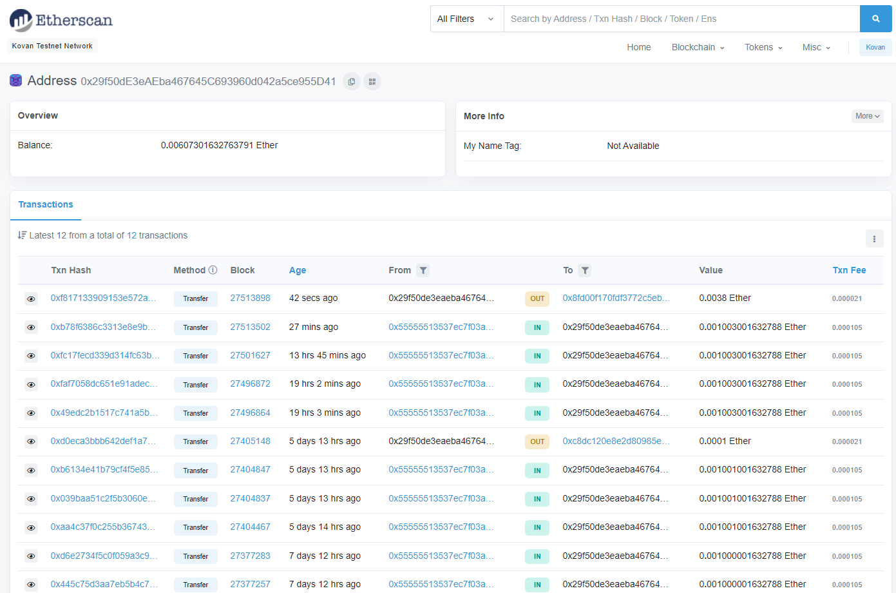

# hw_m19_crypto_transfer

This repo contains files for the Fintech Finder platform that enables customers to send cryptocurrency payments to fintech professionals that they select and hire. It contains 2 files that are used to allow transfer inputs through a streamlit user interface.

The `crypto_wallet.py` file starts by importing dependencies, then creates 3 functions for use in the main file: `generate_account`, `get_balance`, and `send_transaction`.

The `fintech_finder.py` contains the language to run the crypto transfer program, and it begins by importing dependencies, including the functions from the `crypto_wallet.py` file.

To set up the options, this file creates a dictionary of eligible hires with their respective stats, and then a function to display this information on the user interface.

Next, streamlit markdown is added and a sidebar created with the sender's address and ether balance listed at the top. Below, dropdowns are added to allow user selection of person and number of hours; it then lists the selected individual's hourly rate and address, the total to send for the number of hours elected, and a button to execute the transaction.

Following are the examples of this program in use:

